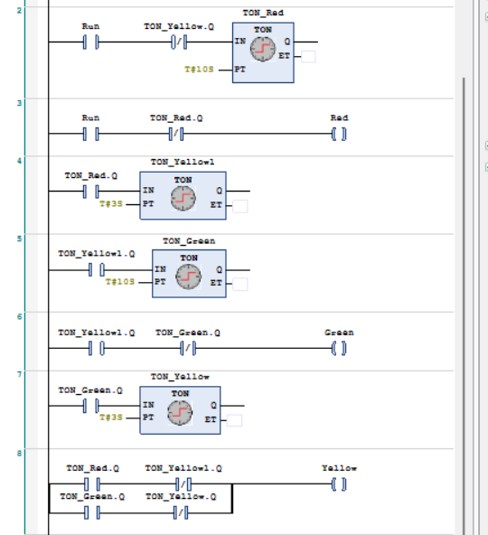

# Day 2 - Timers, Counters & Fault Diagnosis

> "Time-based and count-based industrial control, plus reading a live PLC"

**Duration**: 7 Hours | **Format**: 50% Lecture/Demo + 50% Hands-On Lab
**Prerequisite**: Day 1 — PLC Foundations & Basic Ladder Logic

---

## Learning Outcomes

By the end of Day 2, you will be able to:
- Correctly configure TON, TOF, and RTO timers from timing diagrams and application requirements
- Implement CTU and CTD counters with edge detection for production batch counting
- Explain why ONS/R_TRIG is critical and prove it at the scan level
- Navigate a live PLC in online monitoring mode and interpret rung status
- Force digital I/O for hardware/software fault isolation
- Follow the correct fault triage order (CPU → module → logic)
- Build a 3-phase Traffic Light Controller using a state machine pattern

---

## 1. Timer Instructions

### 1.1 TON — Timer On-Delay

**Function**: Output Q goes TRUE after input IN has been continuously TRUE for the preset duration PT.

#### Function Block Interface

```
        ┌─────────┐
IN ────►│  TON    ├────► Q   (BOOL: TRUE when ET ≥ PT)
PT ────►│         ├────► ET  (TIME: elapsed time, resets to 0 when IN=FALSE)
        └─────────┘
```

#### Internal Pseudo-Code (What the CPU actually does each scan)

```iecst
IF IN = TRUE THEN
    IF ET < PT THEN
        ET := ET + elapsed_scan_time;  // accumulate elapsed time
    END_IF;
    Q := (ET >= PT);                   // assert Q when elapsed ≥ preset
ELSE
    ET := T#0ms;                       // snap reset — no ramp-down
    Q := FALSE;
END_IF;
```

#### Timing Diagram

```
         PT (5s)
          |<──────>|
IN  ____╱‾‾‾‾‾‾‾‾‾‾╲__________╱‾‾‾╲___
ET  ____╱‾‾‾‾‾‾‾‾‾‾╲0__________╱───╲_0_
         (reaches PT)  (snap   (never
                        reset)  reaches PT)
Q   ______________╱‾‾‾╲_________________
                  (ON)  (snap off)
```

#### Key Behaviors

| Behavior | Result |
|:---|:---|
| IN goes FALSE before ET reaches PT | ET snaps to 0, Q never asserts |
| IN held TRUE, ET reaches PT | Q asserts, ET stops at PT |
| IN goes FALSE after Q asserted | Q de-asserts and ET resets on same scan |

#### Example: Motor Pre-Start Delay

```
Power Rail (+)                                                    Power Rail (-)
     │                                                                │
1    ├──[ Start_PB ]──────────────────┬────────────────────────────────┤
     │      (NO)                      │  TON  MotorDelay  PT=5000ms    │
     │                                └────────────────────────────────┤
     │                                                                │
2    ├──[ MotorDelay.Q ]────────────────────────────────( Motor_Run )──┤
     │       (NO)                                          (Coil)      │
```

### 1.2 TOF — Timer Off-Delay

**Function**: Output Q asserts immediately when IN goes TRUE. Q stays TRUE for PT duration after IN goes FALSE.

#### Function Block Interface

```
        ┌─────────┐
IN ────►│  TOF    ├────► Q   (TRUE immediately on IN rise; holds TRUE for PT after IN fall)
PT ────►│         ├────► ET  (counts elapsed time after IN falls)
        └─────────┘
```

#### Timing Diagram

```
IN  ____╱‾‾‾‾‾‾‾‾‾╲____________________________
                   │←──── PT (30s) ────────→│
Q   ____╱‾‾‾‾‾‾‾‾‾‾‾‾‾‾‾‾‾‾‾‾‾‾‾‾‾‾‾‾‾‾╲_____
    (Q rises with IN)           (Q falls PT after IN falls)
```

#### Example: Cooling Fan Run-On After Motor Stops

```
Power Rail (+)                                                    Power Rail (-)
     │                                                                │
1    ├──[ Motor_Running ]──────────────┬────────────────────────────────┤
     │       (NO)                      │  TOF  FanRunOn  PT=30000ms    │
     │                                └────────────────────────────────┤
     │                                                                │
2    ├──[ FanRunOn.Q ]─────────────────────────────────( Fan_Output )──┤
     │       (NO)                                          (Coil)      │
```

### 1.3 RTO — Retentive Timer On-Delay

**Function**: Like TON, but elapsed time ET **accumulates across multiple IN pulses** and is NOT reset when IN goes FALSE. Requires explicit `RES` instruction to reset.

#### When to Use RTO vs TON

| Scenario | Timer Choice | Reason |
|:---|:---|:---|
| Delay before a motor starts | TON | Reset every time Start is released — clean re-trigger |
| Track total motor ON-time in a shift | RTO | Must accumulate across all ON pulses, clear only at shift end |
| Cooling fan run-on after motor stop | TOF | Delay on the falling edge, not rising |

#### RTO Ladder Pattern

```
Power Rail (+)                                                    Power Rail (-)
     │                                                                │
1    ├──[ Motor_Running ]───────────────┬────────────────────────────────┤
     │       (NO)                       │  RTO  MotorRunTime  PT=T#8h   │
     │                                 └────────────────────────────────┤
     │                                                                │
2    ├──[ MotorRunTime.Q ]──────────────────────────( MaintenanceDue )──┤
     │       (NO)                                       (Coil)          │
     │                                                                │
3    ├──[ ShiftEndBtn ]──────────────────────────[ RES MotorRunTime ]──┤
     │       (NO)                                    (Reset RTO)        │
```

---

## 2. Counter Instructions

### 2.1 CTU — Count Up

**Function**: Increments CV (current value) by 1 on each **rising edge** of CU input. Q asserts when CV ≥ PV.

```
        ┌─────────┐
CU ────►│  CTU    ├────► Q   (TRUE when CV ≥ PV)
RESET──►│         ├────► CV  (INT: current count value)
PV ────►│         │
        └─────────┘
```

> ⚠️ CTU does NOT stop counting at PV — CV continues to increment past PV. Use RESET to return CV to 0.

### 2.2 CTD — Count Down

**Function**: Decrements CV on each rising edge of CD. Q asserts when CV ≤ 0. Uses **LOAD** (not RESET) to pre-set CV.

```
        ┌─────────┐
CD ────►│  CTD    ├────► Q   (TRUE when CV ≤ 0)
LOAD ──►│         ├────► CV  (INT: current count value, loaded from PV)
PV ────►│         │
        └─────────┘
```

> ⚠️ CTU uses `RESET` to clear to 0. CTD uses `LOAD` to reload PV. They are NOT symmetric.

### 2.3 Edge Detection — Why ONS/R_TRIG Is Critical

**The Problem**: Without edge detection, a counter rung held TRUE for 2 seconds at a 10ms scan time increments **200 times** instead of once.

**The Proof**:
- Scan time: 10ms
- 2 second hold: 2000ms / 10ms = **200 scans**
- Each scan evaluates the CTU rung with CU=TRUE
- CTU built-in rising-edge detection is NOT active if the rung simply stays TRUE — it sees a continuous level, not a rising edge

**The Fix**: Insert `ONS` / `R_TRIG` before the CTU CU input:

```
Power Rail (+)                                                              Power Rail (-)
     │                                                                           │
1    ├──[ PartSensor ]────[ R_TRIG ]──────────────┬─────────────────────────────┤
     │      (NO)         (Rising Edge)             │  CTU  PartCount  PV=10     │
     │                                            └─────────────────────────────┤
     │                                                                          │
2    ├──[ PartCount.Q ]────────────────────────────────────( BatchComplete )────┤
     │       (NO)                                              (Coil)           │
     │                                                                          │
3    ├──[ ResetBtn ]───────────────────────────────────[ RES PartCount ]────────┤
     │      (NO)                                          (Reset Counter)       │
```

#### R_TRIG Internal Logic (Scan-Level Proof)

```iecst
(* R_TRIG executes this each scan: *)
Q := CurrentInput AND NOT PreviousInput;  // only TRUE for 1 scan on rising edge
PreviousInput := CurrentInput;            // store for next scan comparison
```

---

## 3. Online Monitoring & Fault Diagnosis

### 3.1 Online Monitoring

Going "online" means the programming software connects to the live CPU and shows real-time program execution:
- **Powered rungs** are highlighted (typically green or solid lines)
- **Unpowered rungs** appear dim (dashed or grey)
- **Tag values** are displayed next to each instruction
- **Timer ET and counter CV values** are visible in real-time

### 3.2 Forcing I/O — Mechanism and Hazards

**Mechanism**: Forcing intercepts the value **between the physical terminal and the I/O image table**:

```
Normal:  Physical Terminal ──────────► Input Image Table ──► Logic ──► Output Image Table ──► Physical Terminal
Forced:  Physical Terminal   [FORCED VALUE] ──────────────► Logic ──► [FORCED VALUE] ──────► Physical Terminal
```

**Using Forces for Fault Isolation**:

| Test | What It Proves |
|:---|:---|
| Force input HIGH, logic responds | Input module and wiring from sensor are faulty |
| Force input HIGH, logic doesn't respond | Fault is in PLC program logic |
| Force output HIGH, actuator moves | PLC and wiring to actuator are good |
| Force output HIGH, actuator doesn't move | Fault is in actuator or power circuit |

> ⚠️ **Safety Warning**: Forces bypass safety interlocks! A forced output can energize a motor unexpectedly. Always ensure machine is in a safe state, warn all personnel, and **clear all forces before returning system to production**.

### 3.3 Systematic Fault Triage Order

```
Step 1: CHECK CPU STATE
        └── RUN/STOP/FAULT LED + CPU fault log
        └── Is the CPU in RUN mode? Any major/minor faults logged?

Step 2: CHECK I/O MODULE LEDs
        └── Any module showing FAULT or DIAG LED?
        └── Channel-level fault indicators?

Step 3: ONLINE LOGIC MONITORING
        └── Connect programming software, go online
        └── Watch live rung status and tag values
        └── Use forced I/O to isolate hardware vs software fault
```

> **Do NOT jump to Step 3 first.** If the CPU is in STOP, your online monitoring shows the last-known state — not live execution. Always verify CPU is running before trusting online monitoring.

---

## 4. Day 2 Project - Traffic Light State Machine

### 4.1 State Machine Design

A state machine stores the **current state** in a variable and uses **transitions** (conditions that move between states). No two output coils conflict because only one state is active at a time.

```
        ┌─────────────────────────────────────────┐
        │                                         │
        ▼         10s TON                         │
    ┌─────────┐ ──────────► ┌───────────┐         │
    │ State 0 │             │  State 1  │         │
    │  RED    │             │  GREEN    │         │
    └─────────┘             └───────────┘         │
        ▲                        │ 8s TON         │
        │                        ▼                │
        │ 3s TON          ┌───────────┐           │
        └─────────────────│  State 2  │           │
                          │  YELLOW   │           │
                          └───────────┘           │
                                                  │
```

### 4.2 Ladder Logic Implementation (INT State Register)

```
Power Rail (+)                                                              Power Rail (-)
     │                                                                           │
1    ├──[ EQU TrafficState 0 ]───────────────────────────( Red_Light )──────────┤
     │      (State = RED)                                    (Coil)              │
     │                                                                          │
2    ├──[ EQU TrafficState 0 ]─────────────┬─────────────────────────────────────┤
     │      (State = RED)                  │  TON  TON_Red  PT=10000ms           │
     │                                    └─────────────────────────────────────┤
     │                                                                          │
3    ├──[ TON_Red.Q ]─────────────────────────────────[ MOV 1→TrafficState ]────┤
     │      (Timer done)                              [ RES TON_Red         ]   │
     │                                                                          │
4    ├──[ EQU TrafficState 1 ]───────────────────────────( Green_Light )─────────┤
     │      (State = GREEN)                                  (Coil)             │
     │                                                                          │
5    ├──[ EQU TrafficState 1 ]──────────────┬────────────────────────────────────┤
     │      (State = GREEN)                 │  TON  TON_Green  PT=8000ms         │
     │                                     └────────────────────────────────────┤
     │                                                                          │
6    ├──[ TON_Green.Q ]───────────────────────────────[ MOV 2→TrafficState ]────┤
     │      (Timer done)                              [ RES TON_Green       ]   │
     │                                                                          │
7    ├──[ EQU TrafficState 2 ]──────────────────────────( Yellow_Light )─────────┤
     │      (State = YELLOW)                                (Coil)              │
     │                                                                          │
8    ├──[ EQU TrafficState 2 ]──────────────┬────────────────────────────────────┤
     │      (State = YELLOW)                │  TON  TON_Yellow  PT=3000ms        │
     │                                     └────────────────────────────────────┤
     │                                                                          │
9    ├──[ TON_Yellow.Q ]──────────────────────────────[ MOV 0→TrafficState ]────┤
     │      (Timer done)                              [ RES TON_Yellow      ]   │
```

### 4.3 Structured Text Alternative

```iecst
CASE TrafficState OF
    0: (* RED *)
        Red_Light    := TRUE;
        Green_Light  := FALSE;
        Yellow_Light := FALSE;
        TON_Red(IN := TRUE, PT := T#10s);
        IF TON_Red.Q THEN
            TON_Red(IN := FALSE, PT := T#10s);  // reset timer
            TrafficState := 1;
        END_IF;

    1: (* GREEN *)
        Red_Light    := FALSE;
        Green_Light  := TRUE;
        Yellow_Light := FALSE;
        TON_Green(IN := TRUE, PT := T#8s);
        IF TON_Green.Q THEN
            TON_Green(IN := FALSE, PT := T#8s);
            TrafficState := 2;
        END_IF;

    2: (* YELLOW *)
        Red_Light    := FALSE;
        Green_Light  := FALSE;
        Yellow_Light := TRUE;
        TON_Yellow(IN := TRUE, PT := T#3s);
        IF TON_Yellow.Q THEN
            TON_Yellow(IN := FALSE, PT := T#3s);
            TrafficState := 0;
        END_IF;
END_CASE;
```

### 4.4 CODESYS Ladder Logic Implementation — 3-Phase Traffic Light Controller



**Ladder Diagram Explanation**:
- **Rung 2**: `Run` AND NOT `TON_Yellow.Q` triggers the `TON_Red` timer (10s preset).
- **Rung 3**: `Run` AND NOT `TON_Red.Q` energizes the `Red` light coil.
- **Rung 4**: `TON_Red.Q` triggers `TON_Yellow1` transition timer (3s preset).
- **Rung 5**: `TON_Yellow1.Q` triggers the `TON_Green` timer (10s preset).
- **Rung 6**: `TON_Yellow1.Q` AND NOT `TON_Green.Q` energizes the `Green` light coil.
- **Rung 7**: `TON_Green.Q` triggers `TON_Yellow` transition timer (3s preset).
- **Rung 8**: Dual-branch rung energizes the `Yellow` light coil during Red-to-Green and Green-to-Red transitions.

---

## Day 2 Assessment Tasks (Tasks 1-17)

| Task | Description | Difficulty |
|:---|:---|:---|
| Task 1 | Trace TON timing: Start_PB held 6s, PT=5s. Draw ET and Q | Beginner |
| Task 2 | Trace TON: Start_PB held 3s, PT=5s. Why doesn't Q assert? | Beginner |
| Task 3 | Build cooling fan TOF circuit, test | Intermediate |
| Task 4 | Quiz: Which timer delays on rising edge? Which on falling? | Beginner |
| Task 5 | CTU with PV=10. What is CV after 12 pulses? What is Q? | Beginner |
| Task 6 | Build counter without ONS. Prove double-counting at scan level | Intermediate |
| Task 7 | Explain CTU RESET vs CTD LOAD - why asymmetric? | Intermediate |
| Task 8 | Build edge-triggered batch counter: sensor->ONS->CTU->BatchDone | Intermediate |
| Task 9 | State the correct fault triage order and justify it | Intermediate |
| Task 10 | Force input HIGH to isolate: is fault in sensor or program? | Intermediate |
| Task 11 | Why can't you track shift motor run-time with TON? | Intermediate |
| Task 12 | Identify 3 planted faults in a provided PLC program | Advanced |
| Task 13 | Build debounce counter: sensor must be HIGH 3s before counting | Advanced |
| Task 14 | Build Traffic Light controller (3-state, 3 timers) | Advanced |
| Task 15 | Add pedestrian interrupt - how do you handle timer cleanup? | Advanced |
| Task 16 | Explain missing RES bug - what happens on second cycle? | Advanced |
| Task 17 | Convert Traffic Light to Structured Text CASE statement | Advanced |

---

## Day 2 Files

| File | Description |
|:---|:---|
| [`README.md`](README.md) | This document - Day 2 complete reference |
| [`Day2_Timers_Counters_Beginner_36slides.pptx`](Day2_Timers_Counters_Beginner_36slides.pptx) | Day 2 presentation slides (36 slides on Timers & Counters) |
| [`Day2_Timers_Counters_Troubleshooting.pptx`](Day2_Timers_Counters_Troubleshooting.pptx) | Day 2 presentation slides (Troubleshooting & Fault Triage) |
| [`CTU.project`](CTU.project) | CODESYS project: CTU counter simulation |
| [`triggers.project`](triggers.project) | CODESYS project: Edge-trigger (R_TRIG/F_TRIG) simulation |
| [`Traffic_Light.project`](Traffic_Light.project) | CODESYS project: Traffic light controller simulation |
| [`Traffic_Light_v2.project`](Traffic_Light_v2.project) | CODESYS project: Traffic light v2 (pedestrian interrupt revision) |
| [`Traffic_Light_with_ped_button.project`](Traffic_Light_with_ped_button.project) | CODESYS project: Traffic light with pedestrian push-button |
| [`conveyor_day2.project`](conveyor_day2.project) | CODESYS project: Conveyor belt logic simulation |
| [`images/traffic_light_ladder.png`](images/traffic_light_ladder.png) | CODESYS Ladder Diagram screenshot (Traffic Light 3-Phase timers & coils) |
| [`Ladder_Diagrams.md`](Ladder_Diagrams.md) | All Day 2 ladder diagrams |
| [`Day2_Timers_Counters_Troubleshooting_Teaching_Material.md`](Day2_Timers_Counters_Troubleshooting_Teaching_Material.md) | Full instructor session notes |
| [`Day2_Learning_Content.pdf`](Day2_Learning_Content.pdf) | Day 2 Learning Content PDF |
| [`Day2_Teaching_Material_Expanded.pdf`](Day2_Teaching_Material_Expanded.pdf) | Day 2 Teaching Material Expanded PDF |
| [`day2_tasks_solutions.pdf`](day2_tasks_solutions.pdf) | Day 2 Tasks and Solutions PDF |
| [`Traffic_Light_Controller.st`](Traffic_Light_Controller.st) | Traffic Light ST source code |
